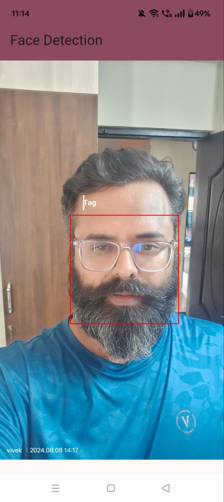
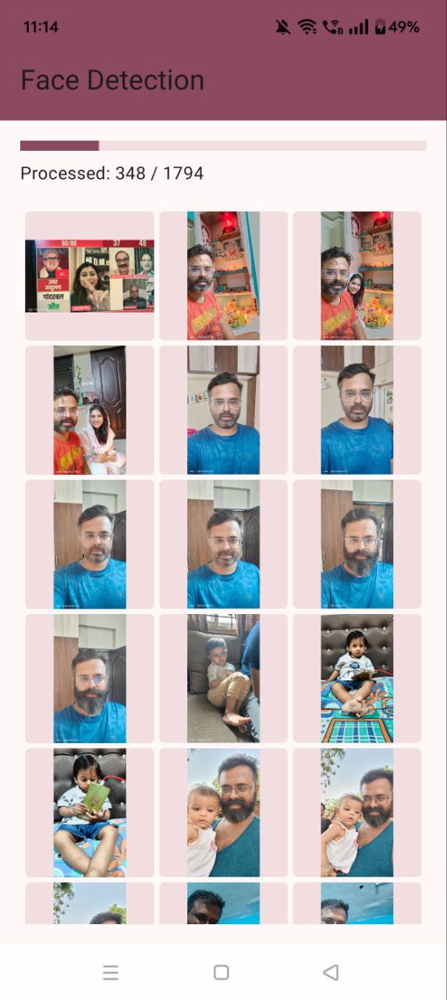

# Face Detection App
## Overview

The Face Detection App utilizes advanced face detection techniques to identify and tag faces in photos.
It provides users with a simple interface to view and manage their photos while highlighting detected faces with bounding boxes.

## Features

- **Face Detection**: Accurately detects and tags faces in photos.
- **Gallery View**: Displays photos in a grid format.
- **Full-Screen Image Viewer**: View images in full-screen mode with bounding boxes.
- **User-Friendly Interface**: Clean and intuitive design.
- **Tag names**: User can provide tags for each face in Fullscreen Image.

## Project Structure

The project follows a modular structure, promoting separation of concerns and easy maintainability. Below is the directory structure:
com.vivek.facedetection │ ├── di │ ├── FaceDetectorModule.kt │ ├── RepositoryModule.kt │ 
├── ui │ ├── PermissionDeniedScreen.kt │ ├── PhotoGrid.kt │ ├── PhotoItem.kt │ ├── GalleryScreen.kt │ ├── FullScreenImageScreen.kt │ ├── FullScreenImageWithBoundingBoxes.kt │ └── state │ ├── UiState.kt │ 
├── model │ ├── Photo.kt │ ├── TaggedDetection.kt │ 
├── repository │ ├── IPhotoRepository.kt │ ├── PhotoRepository.kt  │ 
├── utils │ ├── DimensionUtils.kt │ ├── ImageUtils.kt │ 
├── viewmodel │ ├── GalleryViewModel.kt │ 
├── navigation │ ├── NavigationGraph.kt │ 
├── FaceDetectionApplication.kt └── MainActivity.kt

## Architecture

The app is structured using a **MVVM (Model-View-ViewModel)** architecture, which separates the UI logic from the business logic, allowing for a cleaner, more maintainable codebase.

### Components:

1. **Model**:
    - **Data Classes**: The `Photo` and `TaggedDetection` classes represent the data models used in the application. They encapsulate the data related to photos and detected faces.

2. **View**:
    - **UI Screens**: The `ui` package contains all composable functions that define the user interface, such as `GalleryScreen`, `FullScreenImageScreen`, and `PhotoGrid`.
    - **State Management**: The `UiState` class holds the state of the UI, including loading states, error messages, and lists of photos.

3. **ViewModel**:
    - **GalleryViewModel**: The ViewModel handles the business logic, fetching photos, managing the face detection process, and exposing the UI state. It interacts with the repository to retrieve data and updates the UI state accordingly.

4. **Repository**:
    - **IPhotoRepository & PhotoRepository**: The repository layer abstracts data operations, providing a clean API for the ViewModel. It manages the retrieval of photos and the detection of faces.

5. **Dependency Injection**:
    - **Hilt**: The `di` package contains modules that provide dependencies using Hilt, such as `FaceDetectorModule` and `RepositoryModule`. This facilitates easier testing and modularity.

6. **Navigation**:
    - **NavigationGraph**: This component manages the navigation between different screens in the app.

## Screenshots

| Gallery View          | Full-Screen View with Bounding Boxes |
|-----------------------|-------------------------------------|
|  |  |

## Video Demonstration

Watch a demonstration of the app here:
|  | 

## APK Download

You can download the APK file of the app from the link below:

[Download APK]([path/to/your/app.apk](https://drive.google.com/file/d/1GacIAsz-T3p-JGJt73fnz8iy5hpgBg53/view?usp=sharing))

## Technologies Used

- **Kotlin**: Primary programming language for Android development.
- **Jetpack Compose**: Modern UI toolkit for building native Android UI.
- **Hilt**: Dependency injection library for Android.
- **MediaPipe**: Framework for building multimodal applied machine learning pipelines.

## Getting Started

To run this project locally:

1. Clone the repository:
   ```bash
   git clone https://github.com/vivekprcs/FaceDetection.git
